<style>
  .col2 {
    columns: 2 200px;         /* number of columns and width in pixels*/
    -webkit-columns: 2 200px; /* chrome, safari */
    -moz-columns: 2 200px;    /* firefox */
  }
  .col3 {
    columns: 3 100px;
    -webkit-columns: 3 100px;
    -moz-columns: 3 100px;
  }
</style>

```{r setup, include=FALSE}
library(learnr)
library(tidyverse)
library(nycflights13)
library(Lahman)
tutorial_options(exercise.timelimit = 60)
knitr::opts_chunk$set(error = TRUE, echo = FALSE)
```


```{r, out.width = "400px", fig.align='right'}
knitr::include_graphics("images/inst_bicomplex_4c_c.eps")
```

## Welcome 

In this tutorial, you will learn how to work with Git. We will work through learn how to: 

* setup your environment
* save your code through typical Git workflow
* share your code to collaborate with your team through GitHub
* practice git by yourself and with a team

###

### Background

**What is git?**

Linus Benedict Torvalds, principal developer of the Linux kernel and creator of the distributed version control system Git, said the following about what git means:

*I'm an egotistical bastard, and I name all my projects after myself. First 'Linux', now 'Git’…but git can mean anything, depending on your mood:*

* *Random three-letter combination that is pronounceable, and not actually used by any common UNIX command. The fact that it is a mispronunciation of "get" may or may not be relevant.*
* *Stupid. Contemptible and despicable. Simple. Take your pick from the dictionary of slang.*
* *"Global information tracker": you're in a good mood, and it actually works for you. Angels sing and light suddenly fills the room.*
* *"Goddamn idiotic truckload of sh-t": when it breaks* 

```{r, out.width = "400px"}

```

###

**No, really, what is git?**

Essentially, git is a version control system. There was a time before Google Drive and OneDrive, when you couldn’t have multiple people write to a single document simultaneously. If you had a group project, each person would make edits to a document and share out the various versions as separate documents with fun and ever changing naming conventions. You may even see some of that here with the SDAD team.

```{r, out.width = "600px"}
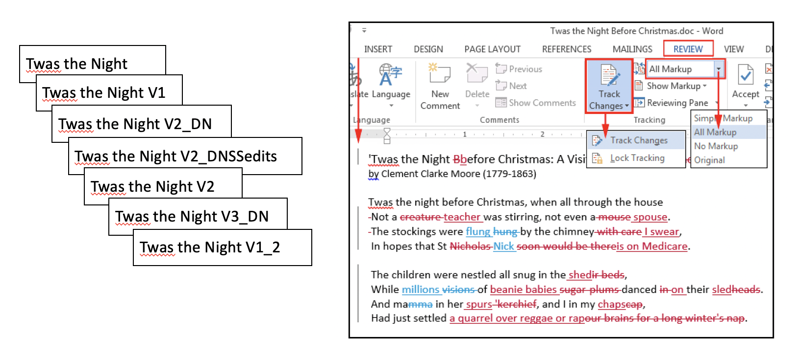
```

A version control system is a tool that manages changes made to the files and directories in a project. Many version control systems exist; this lesson focuses on one called Git, which is used by many of the data science tools covered in our other lessons. Its strengths are:

  * Nothing that is saved to Git is ever lost, so you can always go back to see which results were generated by which versions of your programs.
  * Git automatically notifies you when your work conflicts with someone else's, so it's harder (but not impossible) to accidentally overwrite work.
  * Git can synchronize work done by different people on different machines, so it scales as your team does.

Version control isn't just for software: books, papers, parameter sets, and anything that changes over time or needs to be shared can and should be stored and shared using something like Git.

As far as I know, there is no Google doc for code, nor would you really want one. If any user could overwrite another user’s code at any time, you would potentially lose important chunks of code. Git is a tool that helps you save and manage everyone’s different versions of the code. 

## Background 

### Repositories

Each of your Git projects has two parts: the files and directories that you create and edit directly, and the extra information that Git records about the project's history. The combination of these two things is called a **repository.** Think of git similar to Time Machine for Mac. Time Machine remembers what your entire computer looks like at a single point in time. Git does this by saving information into one of two places. 

The image below shows the Files and Terminal panes of RStudio. 

* The **project directory** shown in the red boxes 
* The **git directory** is shown in the blue box
* The **gitignore** file is shown in the orange box

    
```{r, out.width = "700px"}
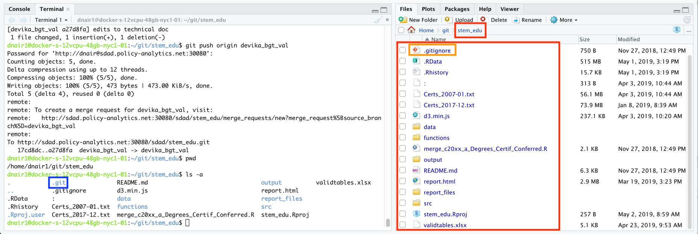
```


###

One place is the **project repository** – which is the collection of files and directories associated with your project work. In this example, we’re looking at the stem_edu project, which has all of these different folders for data, code, and plots. Here in SDAD, we typically require our projects contain the following folder structure: 

* src - your code
* output - any figures or plots from the research
* data - all project data, with subfolders for
    - original data - data in its most original form, as received from the original source, stakeholder, web, etc. 
    - working data - datasets in intermediate stages of analysis and preparation for presentation
    - final data - datasets in final form, required for presentation materials, publication, or sharing with a stakeholder

###

The other place is the **git directory**.  

The git directory is a hidden folder, named *.git*, that documents how a folder has changed. It remembers what the universe of your project repository looks like in at a previous point in time and compares it with the version you are currently working on. As you make changes to your folder – maybe you write new code or generate new figures – git notes the difference between the last version of your repository and your newest version, and saves the information about the changes to the git directory. Git expects this information to be laid out in a very precise way, so you should never edit or delete anything in *.git*.

One important caveat to the *git directory*, is the **.gitignore** file. There are some files we exclude from version control and tracking, namely datasets. The *.gitignore* file allows us to excludes files with particular extensions, like, ".xlsx" or ".csv", so that we can track our files appropriately. 

###

```{r letter-a}
question("Which of the following keeps track of changes between versions of the code base?",
  answer("project directory"),
  answer("git ignore"),
  answer("git directory", correct = TRUE),
  answer("repository")
)
```

```{r letter-b}
question("Which of the following specifies the exceptions to git version tracking?",
  answer(".gitexcept"),
  answer(".gitignore", correct = TRUE),
  answer("git ignore", message = "The name of the file is .gitignore though."),
  answer("repository")
)
```

```{r checkbox1, echo = FALSE}
question_checkbox(
  "What kinds of files should git disregard?",
  answer("original datasets", correct = TRUE),
  answer("final datsets", correct = TRUE),
  answer("working datasets", correct = TRUE),
  answer("git directory", correct = TRUE),
  answer("figures"),
  answer("scripts and Rmarkdowns"),
  answer("Shiny apps"),
  answer("documents"),
  random_answer_order = TRUE,
  allow_retry = TRUE,
  try_again = "Are you sure?"
)
```

```{r checkbox, echo = FALSE}
question_checkbox(
  "What kinds of files should git track?",
  answer("web scraping script", correct = TRUE),
  answer("stakeholder presentation in RMarkdown", correct = TRUE),
  answer("plot of results", correct = TRUE),
  answer("updated version of Shiny app", correct = TRUE),
  answer("network data"),
  answer("text data"),
  answer("comma-separated value datasets"),
  answer("excel datasets"),
  random_answer_order = TRUE,
  allow_retry = TRUE,
  try_again = "Are you sure?"
)
```


## Exercises: Setup

### Git installation


**Step 1:** Check to see if you already have git installed. 

* Open up a terminal window 
* Enter the following: ` git --version `


###

**Step 1:** Depending on what the command outputs, you may or may not need to install git. 

* `git version 2.17.1` You are good to go! 
* `'git' is not recognized as an internal or external command, operable program or batch file` You need to install git!

If you need to install git, visit [these instructions](https://git-scm.com/book/en/v2/Getting-Started-Installing-Git) for installing git into your system.


```{r, out.width = "200px"}

```

```{r git_open_q, echo = FALSE}
question_text(
  "In order to check what version of git you are using, you would use what command?",
  answer("git version", message = "You're missing dashes"),
  answer("git -version", message = "You're missing a dash"),
  answer("Git --version", message = "Git should not be capitalized"),
  answer("git --version", correct = TRUE),
  answer("git —version", correct = TRUE, message = "Note: Even though the 2 dashes auto-corrected to a single long hyphen, you will always need to type in 2 separate dashes into the command line."),
  allow_retry = TRUE
)
```


###  

**Step 2A:** If you don't already have a GitHub account, create one. If you do, go ahead and log into GitHub.  

<!-- * Open up a terminal window  -->
<!-- * Enter the following -->

###

**Step 2B:** Check git setup on your computer. Review the current settings broadly, for all users on your computer, for all projects per current user, and per current project using the following commands.

* `git config --list`
* `git config --list --system`
* `git config --list --global`
* `git config --list --local`

###

**Step 2C:** Setup git on your computer. Add your name and email to your settings, using your GitHub email account.	

* `git config --global user.name "Devika Nair"`
* `git config --global user.email dnair@fandm.edu`

### 

**Step 2D:** Check your git setup with these changes.

* `git config --global user.name`
* `git config –-global user.email`

### Git SSH Keys Setup

SSH keys are authentication credentials used to tell GitHub who is pushing changes to a particular git repository. It can be set up to allow users to send updates without providing your GitHub login credentials every time a set of changes are sent to GitHub.

###

**Step 2E:** Check SSH keys setup. Open terminal to check for existing SSH keys.

* `ls –al ~/.ssh`

**Step 2F:** Generate SSH keys

* `ssh-keygen -t rsa -b 4096 -C "dnair@fandm.edu"` Provide your GitHub email address to generate new SSH keys
* `Enter a file in which to save the key (/home/you/.ssh/id_rsa): [Press enter]`
    - When prompted to "Enter a file", just press Enter. 
    - This accepts default file location. 
* `Enter passphrase (empty for no passphrase): [Type a passphrase]`
    - When prompted to “Enter a passphrase”, just press Enter. 
    - This leaves it blank and makes life easier. 

**Step 2G:** Check SSH keys setup now that you've generated the keys

* `ls –al ~/.ssh`  

###

**Step 2H:** Copy & save the key somewhere safe! 

* `cat ~/.ssh/id_rsa.pub`
    - Use the following to copy the ssh key to your clipboard.
    - Save it somewhere!

**Step 2J:** Add your SSH key to your GitHub account

* Navigate to GitHub settings, then *SSH & GPG Keys*
* Select *New SSH Key* and paste key into text field
* Select *Add SSH key*
* Paste in the id_rsa.pub you copied from *Step 2H*


```{r, out.width = "400px"}
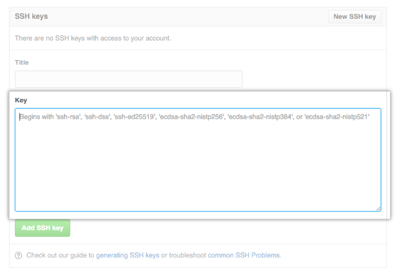
```

###

**Step 2K:** Test your SSH connection manually.

* Return to the Terminal command line
* `ssh -T git@github.com`  

If the message looks like this, then you’re good to continue: 
* `Hi DevikaNair90! You've successfully authenticated, but GitHub does not provide shell access.`

### Git Project Setup

**Step 3A:** Find the `project_template` repository on [DSPG3 GitHub account](https://github.com/DSPG-Young-Scholars-Program). 

* Copy the SSH link

```{r, out.width = "500px"}
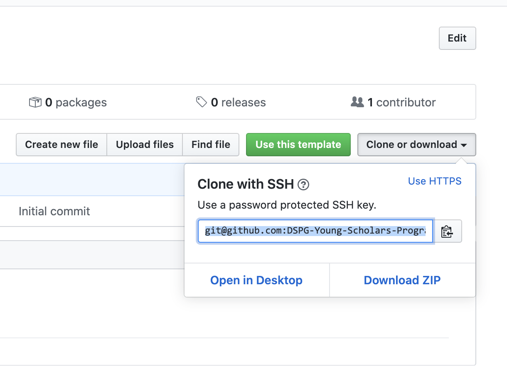
```

**Step 3B:** Create a folder in your home directory called **git**. Clone the project into your RStudio server space using Rstudio. 

* File
* New project 
* Version Control 
* Git

```{r, out.width = "500px"}
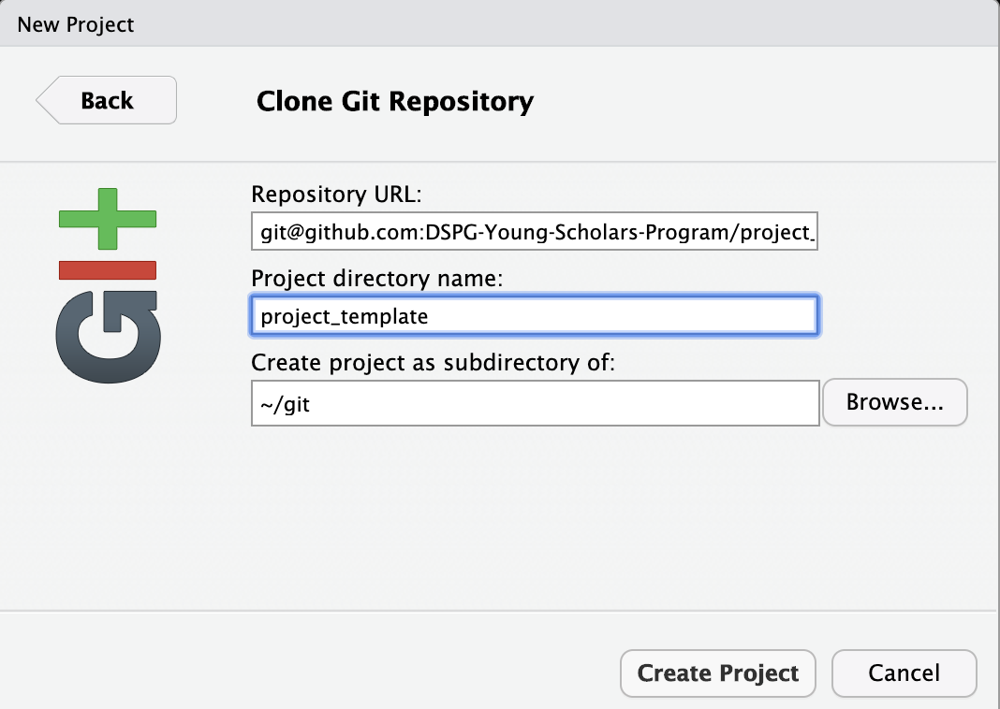
```

Paste in the repository URL from the previous step `git@github.com:DSPG-Young-Scholars-Program/project_template.git`. The project name should autopopulate in the directory name. Make sure the directory location is the new git folder you created. It should look like this: `~/git`.  

### Exercises: Setup Git 

Take this time to setup git on a Rivanna RStudio container. Create a project on your GitHub account by navigating to your GitHub profile and hitting the **NEW** button in green. Give it any name, make it public, include a README and an R style .gitignore. Clone this new project down to Rivanna.

## Git Workflow

```{r, out.width = "500px"}
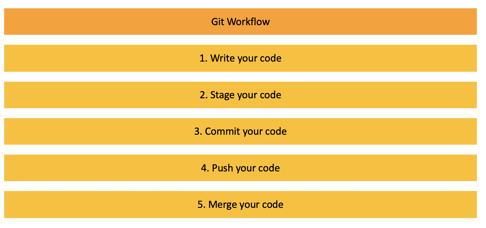
```

### Write your code

```{r, out.width = "500px"}
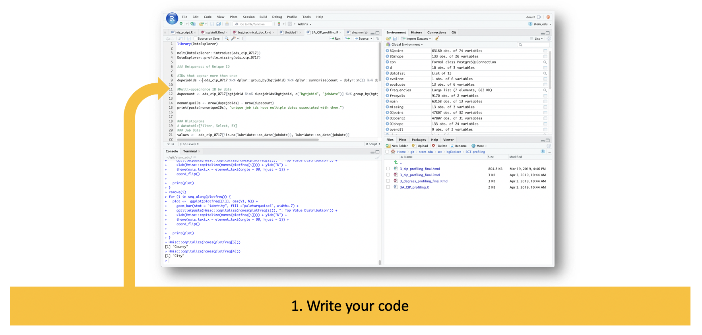
```

Hopefully, you have been programming in R and are familiar with the Console and writing code in scripts or Rmarkdowns. Here, you're just doing your normal programming workflow: writing code, saving out datasets, generating plots, etc. 

Now, you've reached a point where you want to save your progress and memorialize this draft of your code. 

### Stage your code

```{r, out.width = "500px"}
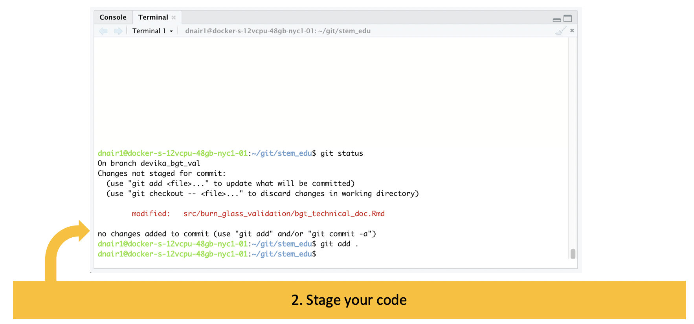
```

'Staging your code' refers to your ability to 'turn on' git tracking for the files in your directory. When you are preparing to stage your code, you will always start by checking your status using the command `git status` which provides a lot of information: 

* Whether there are any changed files to stage:
    - if there aren't, the command line will return `working branch clean, nothing to commit`
    - if there are, the command line will return files in green that have *already* been staged
    - if there are, the command line will return files in red that have *not yet* been staged
* What branch you're on (to be explored later, for now, don't worry about it)

If files appear in red, you will use the command `git add` to stage these and there are two approaches here. You can either choose to stage individual files at a time (e.g., `git add src/newscript.R `) or stage everything in red at once using a dot to signify all (e.g., `git add .`) . 

### Commit your code


```{r, out.width = "500px"}
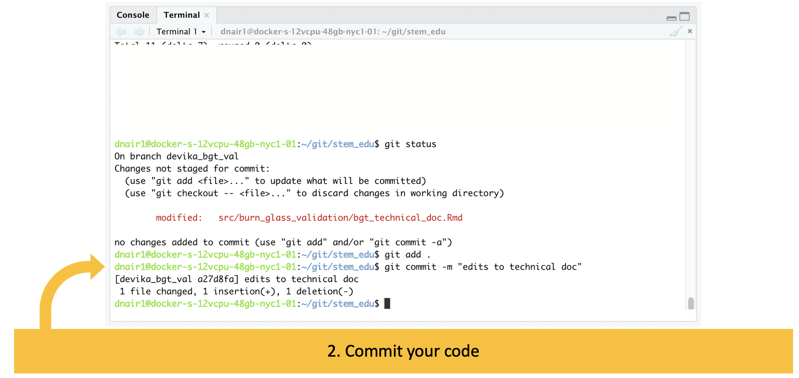
```

Committing your code is the next step, wherein you bundle all the changes you've made into a single commit hash. When you commit your code, you will include a short message about what this bundle of changes includes using the command `git commit -m "made changes to tables and figures"`. 

### Push your code


```{r, out.width = "500px"}
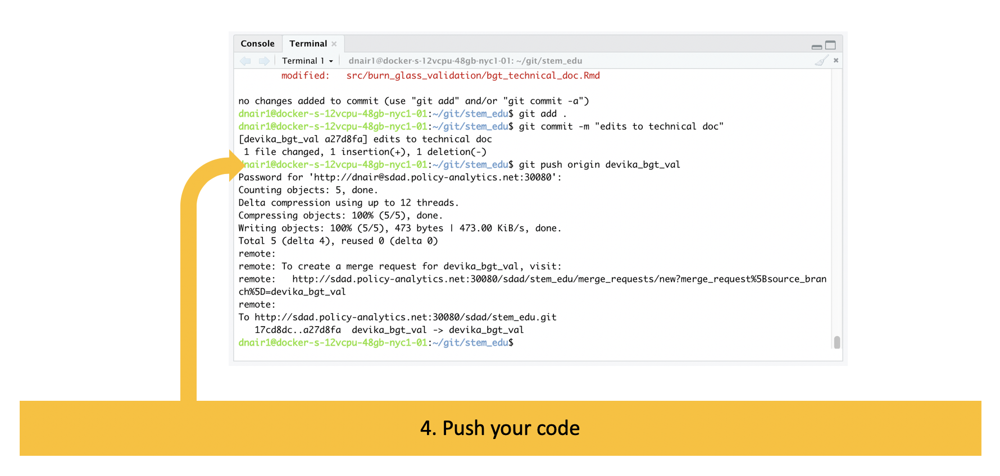
```

The final step is to push your code, meaning you will push all your commits up to GitHub, where others can view your code and work with it. The command here is a simple `git push` though the use of this command will depend on how you've set up your git repo for collaboration, which we'll talk more about in the next section. 


### Check

```{r}
question_rank <- function(..., random_answer_order = TRUE, options = sortable::sortable_options()) {
  learnr::question(
    ...,
    random_answer_order = random_answer_order,
    type = "sortable_rank",
    options = options
  )
}

git_workflow <- c("git status", "git add .", "git commit -m MESSAGE", "git push" )
```


```{r sortable_question, echo = FALSE}
rank_ex <- sortable::question_rank(
  "In what order to run the following git commands? Drag and drop the git commands below to put them in the right order.",
  learnr::answer(git_workflow[1:4], correct = TRUE),
  learnr::answer(rev(git_workflow[1:4]), correct = FALSE, "Other direction!")
)
rank_ex
```

## Exercises: Practice Git

### Practice Git by Yourself

At this point, you have two repositories in your git folder in your home directory: a copy of project_template and a new blank project you created. Open your new project. 

Make some kind of change, for example, creating a new script:

  * File
  * New R script
  * Enter test stuff, like: "#I AM WRITING CODE" or mtcars
  * Save file as test.R

Save these changes using git: 

  * In Terminal 
  * `git status`
  * `git add . `
  * `git commit –m “wrote stuff” `
  * `git push `
  * `git status`
  * Navigate to GitHub – Is your newest code available?


## Git Collaboration


If you are working on a project by yourself - the workflow in the previous section is all you need! You can manage your code this way and always go back and look at older versions of your code using the previous commits. 

If, however, you are working with others on a team - the workflow above takes on one additional feature to help with collaboration. 

### Branches

As organizations work together on a common code base for a given project, managing versions of that code base becomes more important and more complicated. Take for example, a company with a product development cycle. They have to maintain a 'production' version of the code - a master version that ultimately backs their actual product. This version needs to be as pristine as possible, with no bugs, and new code isn't added to it until it's been vetted.

```{r, out.width = "500px"}
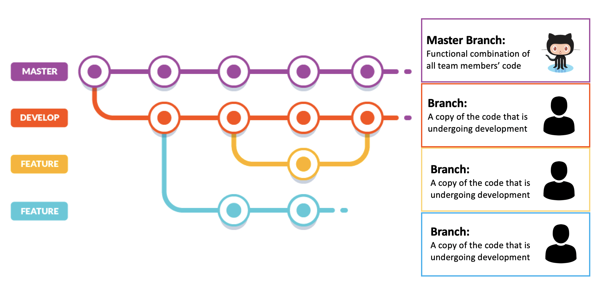
```

To deal with this, git allows for **branches** or copies of the code where teams can make changes without affecting the master copy. In big organizations with product development cycles, branches often represent a team's work on a product's new feature. It is also common to see branches bundling the features together into a 'release' branch that is heavily tested before being incorporated into the master code base. 

#### Git Workflow for Collaboration

```{r, out.width = "500px"}
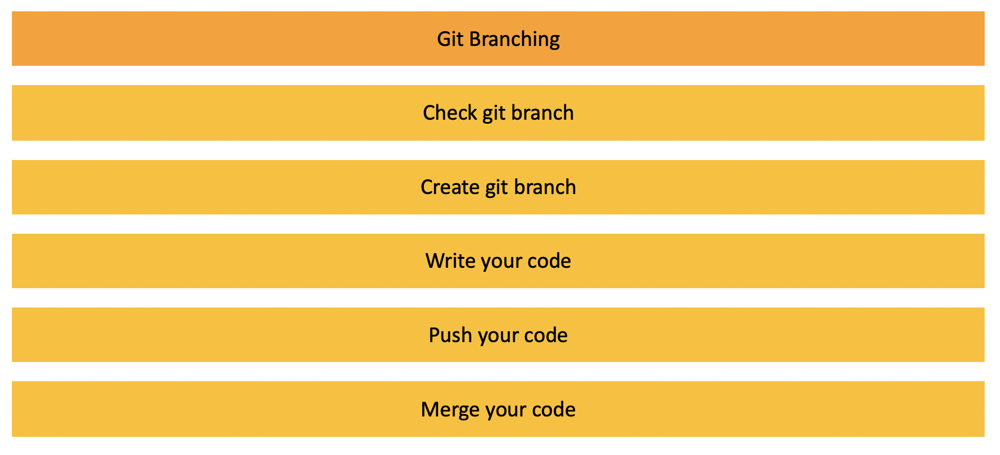
```

#### Check your git branch

Here in SDAD, you will be using branches to collaborate with your project team, to make sure you and your team members' code works together. 

```{r, out.width = "500px"}
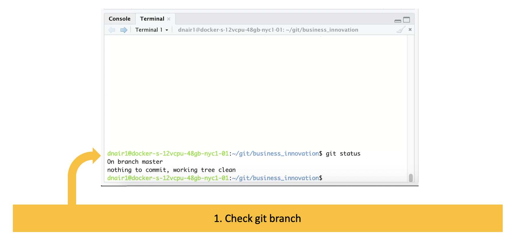
```

To start, the same `git status` command we saw earlier will also show you the branch you're on. Typically, this will default to the master branch. When working with others, NEVER code on master branch. ALWAYS create a separate git branch so code can be reviewed individually. 

#### Create your git branch

```{r, out.width = "500px"}
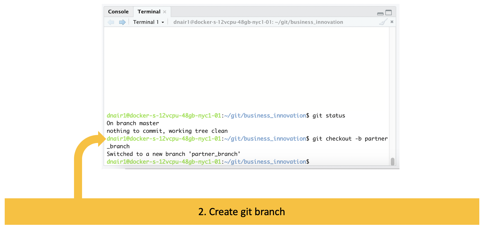
```

You'll need to create a branch here now, using the git command `git checkout -b branchname`. We ask SDAD team members to name their branch with the following name convention: 

* initials or name of team member, e.g., dtmn_
* 1-2 words describing code task, e.g., ingest_articles

From there, you can follow the normal git workflow (staging, committing, and pushing).

#### GitHub Code Merge

```{r, out.width = "500px"}
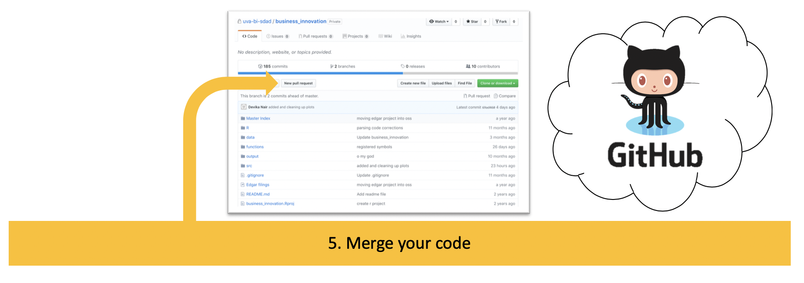
```

When you push your code up to GitHub, you'll see the changes reflected on your branch. 

```{r, out.width = "500px"}
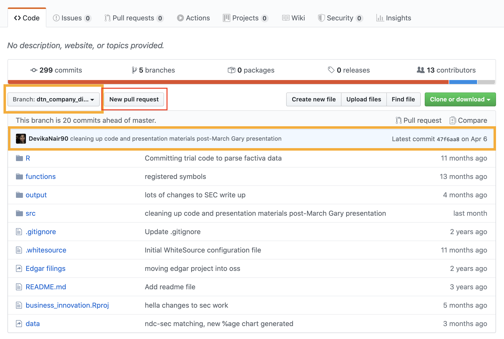
```

Every week, we will gather for code review where your team will performe a **merge** together.

To do this, you will use the "New pull request" button which will open a page that looks ike this, where you can select which branches to merge and any comments to enter on the merge.

* In general, you will likely want to merge all the individual team member's branches first before merging into master.
* GitHub will automatically look for conflicts between the branches. If two team members made changes to the same lines of the same script, for example, this would cause a conflict.
* The commit hashes bundled into this merge are available towards the bottom of the page. These can show the specific code differences.


```{r, out.width = "500px"}
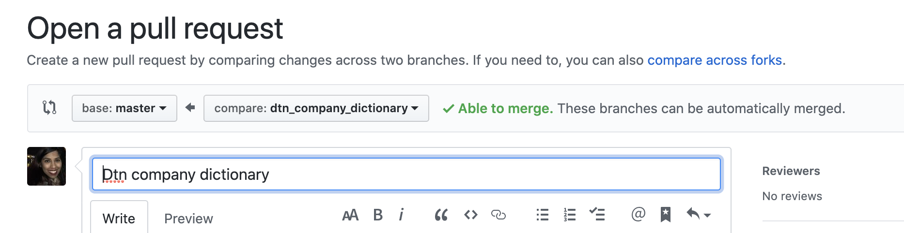
```

We ask our SDAD fellows to take a leadership role in ensuring the health of the project repository by asking the following questions of the team at the weekly code merge:

* Is all code checked in?
* Are all branches merged into master? If not, what conflicts pose challenge?
* Are there any unresolved issues with the scripts, outside of the technical conflicts?
* Could the code be commented for clarity?

```{r, out.width = "500px"}
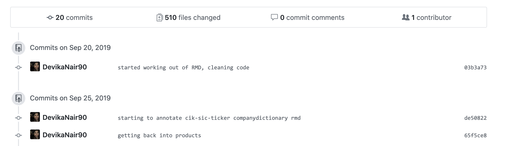
```

## Exercises: Practice Git

### Practice Git by Yourself

At this point, you have two repositories in your git folder in your home directory: a copy of project_template and a new blank project you created. In the last exercise, you pushed changes (a new R script called test.R) to your blank project using the master branch. 

In this exercise, you will create a new branch, make a change, push that branch up, merge the code, and pull down your new and improved master branch. 

A. To begin, check and create the branch you'll be working on. 

  * In Terminal 
  * `git status`
  * `git checkout –b  [branchname]`
  
B. Now code! Make another kind of change, for example, editing the new test.R script:

  * File
  * Open File
  * Select test.R
  * Change the script by adding a new line to look at `head(mtcars)`
  * Save file as test.R

C. Return to the Terminal to stage and push your code. 

  * `git add . `
  * `git commit –m “wrote stuff” `
  * `git push origin [branchname] `
  * `git status`

D. Navigate to GitHub – Is your newest code available?

* Open a pull request
* Set `base` to master and `compare` to your new branch
* Create the merge request
* Explore this page: review the included commits and differences in code within the commit hash
* Complete the merge (may take a series of clicks)

At this point, your master branch will reflect the changes you made in your branch. GitHub may automatically delete your branch. If it doesn't, select the option to delete the branch in GitHub.

E. Now return to the Terminal one last time. 

* `git status` Check if you are still on your branch 
* `git checkout master` Check out the master branch
* `git pull origin master` Refreshes your local copy of master with the updated, merged version in GitHub
* `git branch -d [branchname]` Remove your old branch
  


### Practice Git with Others

With a partner, pick a project you will collaborate on. Repeat Steps A-C of the exercise above so that you have 2 branches on the same project. 

In GitHub, create a pull request between your 2 branches and review the code differences and potential conflicts. Complete the merge request. 


## Git Resources

### Git Weekly Manual 

```{r, out.width = "800px"}
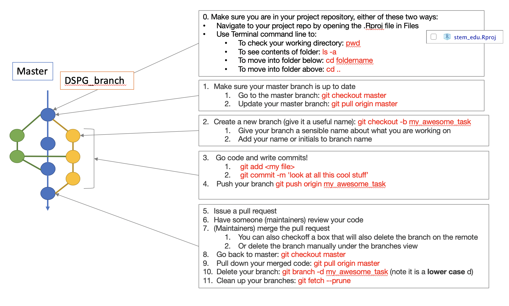
```


0. Make sure you are in your project repository, either of these two ways: 
    *  Navigate to your project repo by opening the .Rproj file in Files 
    *  Use Terminal command line to:
        -  To check your working directory: `pwd`
        -  To see contents of folder: `ls -a`
        -  To move into folder below: `cd foldername`
        -  To move into folder above: `cd ..`
1. Make sure your master branch is up to date
    A.  Go to the master branch: `git checkout master`
    B.  Update your master branch: `git pull origin master`
2. Create a new branch (give it a useful name): `git checkout -b my_awesome_task`
    A.  Give your branch a sensible name about what you are working on
    B.  Add your name or initials to branch name
3. Go code and write commits!
    A.  Stage your code `git add <my file>`
    B.  Commit your code `git commit -m 'look at all this cool stuff’`
    C.  Push your branch `git push origin my_awesome_task`
4. Issue a pull request
    A.  Have someone (maintainers) review your code
    B.  (Maintainers) merge the pull request
        -  You can also checkoff a box that will also delete the branch on the remote
        -  Or delete the branch manually under the branches view
    C.  Go back to master: `git checkout master`
    D.  Pull down your merged code: `git pull origin master`
    E.  Delete your branch: `git branch -d my_awesome_task` (note it is a lower case d) 
    F.  Clean up your branches: `git fetch --prune`

### Additional Learning Resources


I highly recommend the following resources for additional learning and practice.

* Datacamp https://www.datacamp.com/courses/introduction-to-git-for-data-science
* GitHub Classroom https://classroom.github.com/
* Git Branch game https://learngitbranching.js.org/?locale=en_US
* Git Cheat Sheet https://education.github.com/git-cheat-sheet-education.pdf 
