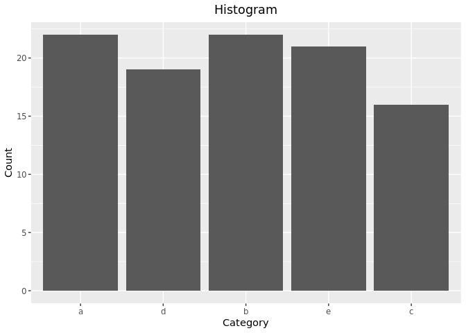

## Introduction to R markdown

What is [Literate programming](https://en.wikipedia.org/wiki/Literate_programming)?

> “Programs are meant to be read by humans and only incidentally for computers to execute.” ― Donald Knuth

R markdowns are programs that mix a markup language (i.e., markdown) with programming languages (e.g., R) to best communicate compared to having either one in isolation. Many markdown features are implemented such as **bold**, *italics*, ***bold and italics*** or hyperlinks such as the previous example. It is easily integrated withing [RStudio](https://www.rstudio.com/) the flagship integrated development environment ([IDE](https://en.wikipedia.org/wiki/Integrated_development_environment)) for R.

## Setting up RStudio

- Global options for RStudio

Many newcomers and advanced users alike can benefit from customizing their RStudio global options. For example, I personally like a dark dark mode theme such as Tomorrow Night 80. Many options under the Code menu can help you adhere to best practices, catch issues, or follow a standard coding style.

- The `.Rprofile` in the HOME directory can be used to modify startup behavior

For example, my `~/.Rprofile` file has the following code


```r
for (ln in readLines(con = "~/.bashrc")) {
  if (startsWith(x = ln, prefix = "export")) {
    x <- sub(pattern = "export\\s*", replacement = "", x = ln)
    if (!grepl(pattern = "=\"", x = x, perl = TRUE)) {
      x <- gsub(pattern = "((?<==)|$)", replacement = "\"", x = x, perl = TRUE)
    }
    eval(expr = parse(text = paste0("Sys.setenv(", x, ")")))
  }
}
rm(list = ls())
if (interactive()) {
  try(expr = fortunes::fortune(), silent = TRUE)
}
message(cat("Welcome, Dr. Nosferican.\nLogged at: ", as.character(Sys.time()), Sys.getenv(x = "TZ")))
```

which displays an R fortune cookie, a welcome message and current time when I start a session.
The fortune cookie is a random piece of R history/culture very useful to understand the
philosophy behind the project.

## Setting up your environment (Housekeeping)

For the following lesson, we will be using various functionality available in
R packages. The following code will make the namespace (e.g., functions) available
for us to use.

The next block of code will provide all the functionality we will be using during
this lesson


```r
invisible(x = suppressPackageStartupMessages(expr = library(package = tidyverse)))
invisible(x = suppressPackageStartupMessages(expr = library(package = lubridate)))
```

## Atomic data types

R has six atomic data types:

- `logical`
- `integer`
- `numeric` (alias for double precision)
- `complex`
- `character`
- `raw`

### Logical


```r
x <- c(`NA` = NA, `FALSE` = FALSE, `TRUE` = TRUE)
```

`&` Table


```r
outer(X = x, Y = x, FUN = "&")
```

```
##          NA FALSE  TRUE
## NA       NA FALSE    NA
## FALSE FALSE FALSE FALSE
## TRUE     NA FALSE  TRUE
```

`|` Table


```r
outer(X = x, Y = x, FUN = "|")
```

```
##         NA FALSE TRUE
## NA      NA    NA TRUE
## FALSE   NA FALSE TRUE
## TRUE  TRUE  TRUE TRUE
```

`xor` Table


```r
outer(X = x, Y = x, FUN = "xor")
```

```
##       NA FALSE  TRUE
## NA    NA    NA    NA
## FALSE NA FALSE  TRUE
## TRUE  NA  TRUE FALSE
```

Negation


```r
!TRUE
```

```
## [1] FALSE
```

```r
!FALSE
```

```
## [1] TRUE
```

```r
!NA
```

```
## [1] NA
```

Logical interpretation of integers/numeric


```r
TRUE & 0 # (TRUE & (0 != 0))
```

```
## [1] FALSE
```

```r
FALSE | -2 # (FALSE | (-2 != 0))
```

```
## [1] TRUE
```

### Integer


```r
x <- 2L
y <- 3L
+x # Positive sign
```

```
## [1] 2
```

```r
-x # Negative sign
```

```
## [1] -2
```

```r
abs(x = x)
```

```
## [1] 2
```

```r
x + y
```

```
## [1] 5
```

```r
x - y
```

```
## [1] -1
```

```r
x * y
```

```
## [1] 6
```

```r
x / y
```

```
## [1] 0.6666667
```

```r
x^y
```

```
## [1] 8
```

```r
sqrt(x = x)
```

```
## [1] 1.414214
```

```r
x %% y # Modulus
```

```
## [1] 2
```

```r
x %/% y # Integer division
```

```
## [1] 0
```

```r
log(x = x)
```

```
## [1] 0.6931472
```

```r
exp(x = x)
```

```
## [1] 7.389056
```

```r
factorial(x = x)
```

```
## [1] 2
```

### Numeric


```r
x <- 2.5
y <- 3.2
```


```r
+x # Positive sign
```

```
## [1] 2.5
```

```r
-x # Negative sign
```

```
## [1] -2.5
```

```r
abs(x = x)
```

```
## [1] 2.5
```

```r
x + y
```

```
## [1] 5.7
```

```r
x - y
```

```
## [1] -0.7
```

```r
x * y
```

```
## [1] 8
```

```r
x / y
```

```
## [1] 0.78125
```

```r
x^y
```

```
## [1] 18.76757
```

```r
sqrt(x = x)
```

```
## [1] 1.581139
```

```r
x %% y # Modulus
```

```
## [1] 2.5
```

```r
x %/% y # Integer division
```

```
## [1] 0
```

```r
log(x = x) # Log (defaults to natural log)
```

```
## [1] 0.9162907
```

```r
exp(x = x)
```

```
## [1] 12.18249
```

```r
factorial(x = x)
```

```
## [1] 3.323351
```

```r
round(x = x, digits = 2L)
```

```
## [1] 2.5
```

```r
floor(x = x)
```

```
## [1] 2
```

```r
ceiling(x = x)
```

```
## [1] 3
```

### Complex

```r
x = 2 + 1i
y = 3 + 1i
```


```r
+x # Positive sign
```

```
## [1] 2+1i
```

```r
-x # Negative sign
```

```
## [1] -2-1i
```

```r
abs(x = x)
```

```
## [1] 2.236068
```

```r
x + y
```

```
## [1] 5+2i
```

```r
x - y
```

```
## [1] -1+0i
```

```r
x * y
```

```
## [1] 5+5i
```

```r
x / y
```

```
## [1] 0.7+0.1i
```

```r
x^y
```

```
## [1] -4.113793+5.703463i
```

```r
sqrt(x = x)
```

```
## [1] 1.455347+0.343561i
```

```r
log(x = x) # Log (defaults to natural log)
```

```
## [1] 0.804719+0.4636476i
```

```r
exp(x = x)
```

```
## [1] 3.992324+6.217676i
```

```r
x == y
```

```
## [1] FALSE
```

```r
is.complex(x = x)
```

```
## [1] TRUE
```

```r
Re(z = x)
```

```
## [1] 2
```

```r
Im(z = x)
```

```
## [1] 1
```

```r
Mod(z = x)
```

```
## [1] 2.236068
```

```r
Arg(z = x)
```

```
## [1] 0.4636476
```

```r
Conj(z = x)
```

```
## [1] 2-1i
```

### Character


```r
x <- "\"R still doesn't like emojis... Julia does\" - Bayoán (史志鼎)"
str_detect(string = x, pattern = "Bayoán")
```

```
## [1] TRUE
```

```r
str_detect(string = x, pattern = "Nosferican")
```

```
## [1] FALSE
```

```r
str_extract(string = x, pattern = "(?<=\" - ).*")
```

```
## [1] "Bayoán (史志鼎)"
```

```r
str_sub(string = x, start = 28L, end = 32L)
```

```
## [1] "s... "
```

```r
str_replace(string = x, pattern = "(?<=\" - ).*", "Me")
```

```
## [1] "\"R still doesn't like emojis... Julia does\" - Me"
```

```r
str_remove(string = x, pattern = "e")
```

```
## [1] "\"R still dosn't like emojis... Julia does\" - Bayoán (史志鼎)"
```

```r
str_replace_all(string = x, pattern = "e", replacement = "E")
```

```
## [1] "\"R still doEsn't likE Emojis... Julia doEs\" - Bayoán (史志鼎)"
```

```r
cat(str_c("This is a fine quote.", x, sep = " "))
```

```
## This is a fine quote. "R still doesn't like emojis... Julia does" - Bayoán (史志鼎)
```

## Collections

### Arrays

Arrays are collections of homogeneous data types. The most common types are the
one dimensional array (`vector`) and the two dimensional array (`matrix`).


```r
vector(mode = "logical", length = 2L)
```

```
## [1] FALSE FALSE
```

```r
vector(mode = "character", length = 5L)
```

```
## [1] "" "" "" "" ""
```

```r
vector(mode = "numeric", length = 3L)
```

```
## [1] 0 0 0
```

```r
vector(mode = "integer", length = 4L)
```

```
## [1] 0 0 0 0
```


```r
x <- 1:10
str(object = x)
```

```
##  int [1:10] 1 2 3 4 5 6 7 8 9 10
```

```r
summary(object = x)
```

```
##    Min. 1st Qu.  Median    Mean 3rd Qu.    Max. 
##    1.00    3.25    5.50    5.50    7.75   10.00
```

```r
table(origininal_object = x)
```

```
## origininal_object
##  1  2  3  4  5  6  7  8  9 10 
##  1  1  1  1  1  1  1  1  1  1
```

```r
x[2:5] <- 1L
table(modified_object = x)
```

```
## modified_object
##  1  6  7  8  9 10 
##  5  1  1  1  1  1
```

```r
x[11] <- NA
typeof(x)
```

```
## [1] "integer"
```

```r
sort(x = x, decreasing = TRUE, na.last = TRUE) # default values TRUE and NA
```

```
##  [1] 10  9  8  7  6  1  1  1  1  1 NA
```

```r
x[13] <- "A"
x
```

```
##  [1] "1"  "1"  "1"  "1"  "1"  "6"  "7"  "8"  "9"  "10" NA   NA   "A"
```

```r
is.vector(x = x)
```

```
## [1] TRUE
```

Matrices


```r
x <- matrix(data = 1:16,
            nrow = 4L,
            ncol = 4L,
            dimnames = list(LETTERS[1:4], letters[1:4]))
x
```

```
##   a b  c  d
## A 1 5  9 13
## B 2 6 10 14
## C 3 7 11 15
## D 4 8 12 16
```

```r
x + 2 * x
```

```
##    a  b  c  d
## A  3 15 27 39
## B  6 18 30 42
## C  9 21 33 45
## D 12 24 36 48
```

```r
t(x) %*% x
```

```
##     a   b   c   d
## a  30  70 110 150
## b  70 174 278 382
## c 110 278 446 614
## d 150 382 614 846
```

```r
str(object = x)
```

```
##  int [1:4, 1:4] 1 2 3 4 5 6 7 8 9 10 ...
##  - attr(*, "dimnames")=List of 2
##   ..$ : chr [1:4] "A" "B" "C" "D"
##   ..$ : chr [1:4] "a" "b" "c" "d"
```

```r
summary(object = x)
```

```
##        a              b              c               d        
##  Min.   :1.00   Min.   :5.00   Min.   : 9.00   Min.   :13.00  
##  1st Qu.:1.75   1st Qu.:5.75   1st Qu.: 9.75   1st Qu.:13.75  
##  Median :2.50   Median :6.50   Median :10.50   Median :14.50  
##  Mean   :2.50   Mean   :6.50   Mean   :10.50   Mean   :14.50  
##  3rd Qu.:3.25   3rd Qu.:7.25   3rd Qu.:11.25   3rd Qu.:15.25  
##  Max.   :4.00   Max.   :8.00   Max.   :12.00   Max.   :16.00
```

```r
table(x)
```

```
## x
##  1  2  3  4  5  6  7  8  9 10 11 12 13 14 15 16 
##  1  1  1  1  1  1  1  1  1  1  1  1  1  1  1  1
```

```r
x[3, 2] <- NA
x
```

```
##   a  b  c  d
## A 1  5  9 13
## B 2  6 10 14
## C 3 NA 11 15
## D 4  8 12 16
```

Arrays


```r
x <- array(data = 1:3, dim = c(2L, 4L, 3L))
x
```

```
## , , 1
## 
##      [,1] [,2] [,3] [,4]
## [1,]    1    3    2    1
## [2,]    2    1    3    2
## 
## , , 2
## 
##      [,1] [,2] [,3] [,4]
## [1,]    3    2    1    3
## [2,]    1    3    2    1
## 
## , , 3
## 
##      [,1] [,2] [,3] [,4]
## [1,]    2    1    3    2
## [2,]    3    2    1    3
```

```r
str(object = x)
```

```
##  int [1:2, 1:4, 1:3] 1 2 3 1 2 3 1 2 3 1 ...
```

```r
dim(x = x)
```

```
## [1] 2 4 3
```

### Lists


```r
x <- list(x = 1:5, y = TRUE, z = c("A", "Z"))
str(object = x)
```

```
## List of 3
##  $ x: int [1:5] 1 2 3 4 5
##  $ y: logi TRUE
##  $ z: chr [1:2] "A" "Z"
```

```r
x$z
```

```
## [1] "A" "Z"
```

```r
x$A <- 23L
x
```

```
## $x
## [1] 1 2 3 4 5
## 
## $y
## [1] TRUE
## 
## $z
## [1] "A" "Z"
## 
## $A
## [1] 23
```

```r
x[1L]
```

```
## $x
## [1] 1 2 3 4 5
```

```r
x[[1L]]
```

```
## [1] 1 2 3 4 5
```

```r
x[[4]] <- list(a = 3, b = 2)
x
```

```
## $x
## [1] 1 2 3 4 5
## 
## $y
## [1] TRUE
## 
## $z
## [1] "A" "Z"
## 
## $A
## $A$a
## [1] 3
## 
## $A$b
## [1] 2
```

```r
x$A$b
```

```
## [1] 2
```

## Structs

Date time objects are structs can wrap an atomic data element for special functionality


```r
x <- now()
year(x = x)
```

```
## [1] 2020
```

```r
month(x = x)
```

```
## [1] 6
```

```r
day(x = x)
```

```
## [1] 4
```

```r
hour(x = x)
```

```
## [1] 18
```

```r
minute(x = x)
```

```
## [1] 18
```

```r
second(x = x)
```

```
## [1] 58.07195
```

```r
seconds(x = x)
```

```
## [1] "1591309138.07195S"
```

```r
x %m+% months(x = 1L, abbreviate = TRUE)
```

```
## [1] "2020-07-04 18:18:58 AST"
```

Named vectors are an example of a struct with more than one atomic data type element


```r
x <- c(a = 1L, b = 2L)
str(object = x)
```

```
##  Named int [1:2] 1 2
##  - attr(*, "names")= chr [1:2] "a" "b"
```

```r
names(x = x)
```

```
## [1] "a" "b"
```

One last example includes categorical or factor variables


```r
set.seed(seed = 0L)
x <- as_factor(x = sample(x = letters[1:5], size = 100L, replace = TRUE))
str(x)
```

```
##  Factor w/ 5 levels "a","d","b","e",..: 1 2 1 3 4 5 3 5 5 1 ...
```

```r
x[10L]
```

```
## [1] a
## Levels: a d b e c
```

```r
levels(x = x)
```

```
## [1] "a" "d" "b" "e" "c"
```

```r
ggplot(mapping = aes(x = x)) +
  geom_bar() +
  labs(title = "Histogram",
       x = "Category",
       y = "Count") +
  theme(plot.title = element_text(hjust = 0.5))
```

<!-- -->
