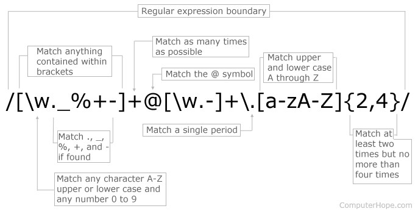

class: 

```{r, include = FALSE}
devtools::install_github("gadenbuie/countdown")
library(xaringan)
```

# Regular expressions
A [regular expression](https://en.wikipedia.org/wiki/Regular_expression) (regex) is a sequence of characters that define a search pattern.

--

Regex can be used across multiple programming languages to help identify, match, extract, locate, replace, split, ... patterns from text. 

--

background-image: url(images/4why1.png)
background-position: 50% 90%
background-size: 70%

--

background-image: url(images/4why2.png)
background-position: 50% 90%
background-size: 45%

--

background-image: url(images/4why3.jpg)
background-position: 50% 90%
background-size: 65%

---
# Some common R functions
<br/>

| Function   | Base                          | Stringr                   |
|------------|-------------------------------|---------------------------|
| Extract    | `regmatches`                  | `str_extract`, `str_match`|
| Detect     | `grep`, `grepl`               | `str_which`, `str_detect` |
| Substitute | `gsub`, `sub`, `substr`       | `str_replace`, `str_sub`  |
| Locate     | `gregexpr`, `regexpr`         | `str_locate`              |
| Split      | `strsplit`                    | `str_split`               |

<br/>
Lengthy comparison [here](https://stringr.tidyverse.org/articles/from-base.html). 
---
class: center
# Here's what it looks like
<br>



---
class: inverse

background-image: url(images/3cry.jpeg)
background-position: 50% 30%
background-size: 42%

---
class: inverse, center, middle

# A quick tour of what's out there

---
# Characters

| Symbol                                         | Function                                       |
|------------------------------------------------|------------------------------------------------|
| `[ ]`                                          | Match character within square brackets.        |
| `[^ ]`                                         | Match character not within square brackets.    |
| `[0-9]`, `[:digit:]`, `\d`                     | Match number.                                  |
| `[^0-9]`, `\D`                                 | Match non-number.                              |
| `[a-z]`, `[:lower:]`                           | Match lowercase character.                     |
| `[A-Z]`, `[:upper:]`                           | Match uppercase character.                     |
| `[A-z]`, `[[:lower:][:upper:]]`, `[:alpha:]`   | Match alphabetic character.                    |
| `[A-z0-9]`, `[[:alpha:][:digit:]]`, `[:alnum:]`| Match alphanumeric character.                  |
| `\w`, `[A-z0-9_]`, `[[:alnum:]_]`              | Match word characters.                         |
| `\W`, `[^A-z0-9_]`                             | Match non-word characters.                    |
| `[:punct:]`                                    | Match punctuation characters.                 |

---
# Characters

.pull-left[
**Example**
```{r example1, eval = FALSE}
library(stringr)

hex <- c("#FFFFFF", "#CE9F9F", "#000000")

str_extract_all(hex, "[0-9]")
str_extract_all(hex, "[A-Z][0-9]")
```
]

--
.pull-right[
**Output**

```{r example1-out, ref.label = "example1", echo = FALSE}
```
]

---
# Quantity

| Symbol    | Function                                                             |
|-----------|----------------------------------------------------------------------|
| `x-y`     | Match this character range.                                          |
| `.`       | Match any single character (except new line).                        |
| `?`       | The previous symbol is optional.                                     |
| `*`       | Match 0+ previous symbol repetitions.                                |
| `+`       | Match 1+ previous symbol repetitions.                                |
| `{x}`     | Match exactly x repetitions of the previous symbol.                  |
| `{x, }`   | Match at least x repetitions of the previous symbol.                 |
| `{ , x}`  | Match at most x repetitions of the previous symbol.                  |
| `{x , y}` | Match between x and y repetitions (inclusive) of the previous symbol.|


.footnote[
The `+`, `*`, and `?` quantifiers are greed by default. This means they will match as many characters as possible. To make them lazy/reluctant, causing them to capture as few characters as possible, add a `?` (`+?`, `*?`, `??`).
]

---
# Quantity

.pull-left[
**Example**
```{r example2, eval = FALSE}
hex <- c("#FFFFFF", "#CE9F9F", "#000000")

str_extract_all(hex, "[0-9]")
str_extract_all(hex, "[0-9]+")
str_detect(hex, "[:digit:]{3,}")
```
]

--
.pull-right[
**Output**

```{r example2-out, ref.label = "example2", echo = FALSE}
```
]

---
class: center
# Escape

To use a metacharacter (`(`, `)`, `[`, `]`, `{`, `}`, `^`, `$`, `.`, `\`, `?`, `*`, `+`, `|`), you'll have to "escape" it first. 


---
# Spaces

| Symbol             | Function                                                                           |
|--------------------|------------------------------------------------------------------------------------|
| `[:blank:]`        | Match any blank character (space, tab).                                            |
| `[:space:]`        | Match any space character (space, tab, new line, vertical tab, form feed, return). |
| `\s`               | Match any space.                                                                   |
| `\S`               | Match any non-space.                                                               |
| `\h`               | Match any horizontal space.                                                        |
| `\H`               | Match any non-horizontal space.                                                    |
| `\v`               | Match any vertical space.                                                          |
| `\V`               | Match any non-vertical space.                                                      |
| `\n`               | Match any new line.                                                               |
| `\r`               | Match any carriage return.                                                         |
| `\t`               | Match any tab.                                                                     |

---
# Spaces

.pull-left[
**Example**
```{r example3, eval = FALSE}
bateman <- c("I live in the American Gardens building
             on West 81st street.")

str_locate_all(bateman, "\\s[A-Z]")
str_extract_all(bateman, "[:blank:][A-Z][a-z]+")
```
]

--
.pull-right[
**Output**

```{r example3-out, ref.label = "example3", echo = FALSE}
```
]

---
# Position and order

| Symbol  | Function  
|---------|------------------------------------------------------|
| `^`     | Match at string beginning.                           |
| `$`     | Match at string end.                                 |
| `\b`    | Match at word boundary.                              |
| `\B`    | Match at word non-boundary.                          |
| `(   )` | Match this group.                                    |
| <code> &#124; </code>      | Match the symbol before or after. |
| `\`     | Escape the next character.                           |

---
# Position and order

**Example**
```{r example4, eval = FALSE}
bateman <- c("I live in the American Gardens building on West 81st street.")

str_extract_all(bateman, "[:alnum:]*t[:alnum:]*")
str_extract_all(bateman, "[:alnum:]*t\\b")
```

--
**Output**

```{r example4-out, ref.label = "example4", echo = FALSE}
```

---
# Lookarounds

Lookarounds will look ahead or behind before attempting to capture or locate any pattern. 

--

For example, we might be working with a text that talks about a **bank** robber who ran towards the river **bank** with his bounty, but we're only interested in capturing something about the robber and not so much in the river. A lookaround would help us limit our search. 

--
<br>
<br>

| Symbol        | Function  
|---------------|----------------------------------------------------------------------------------|
| `(?=query)`   | Positive lookahead: "query" immediately follows the current position.            |
| `(?!query)`   | Negative lookahead: "query" does _not_ immediately follow the current position.  |
| `(?<=query)`  | Positive lookbehind: "query" immediately precedes the current position.          |
| `(?<!query)`  | Negative lookbehind: "query" does _not_ immediately precede the current position.|

---
# Lookarounds

**Example**
```{r example6, eval = FALSE}
patient <- "Name: Jane
            Age: 25
            Condition: OK"

str_extract_all(patient, "(?<=Name: )")
str_extract_all(patient, "(?<=Name: )\\w+")
```

--
**Output**

```{r example6-out, ref.label = "example6", echo = FALSE}
```

---
class: inverse, center, middle

# Help!

---
# Intuitive regex

**Rex** is a nifty library that helps you build easily modifiable regex queries. 

You might write the perfect search pattern to suit your use case, but you will likely end up with something three times the length of  `(?:\\.(?:[a-z0-9\u00a1-\uffff](?:-)*)` that will be difficult to interpret to a colleague, or to you after you haven't touched the code in six months.

--

.pull-left[
Install and load the `rex` library.
```{r example7, results = "hide"}
# install.packages("rex")
library(rex)
```
]

--
.pull-right[
Check out some of the available `rex` tools:
```{r, results = "hide"}
names(shortcuts)
?wildcards
?lookarounds
```

Type `?rex` to get access the package index and vignettes.
]

---
# Insta-regex
Some canned, R-ready regex is available in `qdapRegex` (see [here](http://trinker.github.io/qdapRegex/index.html)).

```{r, results = "hide"}
# install.packages("qdapRegex")
library(qdapRegex)
?qdapRegex
```

---
class: inverse, center, middle

# Let's try it out!

---
class: inverse, center, middle

```{r, include = FALSE}
library(countdown)
```

# http://play.inginf.units.it
If the website above is down... <br />
https://alf.nu/RegexGolf <br />
https://regex.sketchengine.co.uk/cgi/ex1.cgi

`r countdown(minutes = 30, seconds = 00, play_sound = TRUE, font_size = "70px", color_text = "#23373B", color_background = "#FFFFFF", color_running_background = "#FFFFFF", color_running_text = "#23373B", color_finished_background = "#FFFFFF", color_finished_text = "#23373B", top = "60%")`

---
# More

## Fun
* Practice: [RegexOne lessons](https://regexone.com/), [FreeCodeCamp lessons](https://scrimba.com/g/gregularexpressions).
* Test query + canned regex: [Regex101](https://regex101.com/), [RegexR](https://regexr.com/), [Debuggex](https://www.debuggex.com/).
* Games: [The regex game](http://play.inginf.units.it/#/), [regex crossword](https://regexcrossword.com/).

## Presentation best practices :)
Slides via [**xaringan**](https://github.com/yihui/xaringan), xaringan via [remark.js](https://remarkjs.com), [knitr](http://yihui.name/knitr), and [R Markdown](https://rmarkdown.rstudio.com).