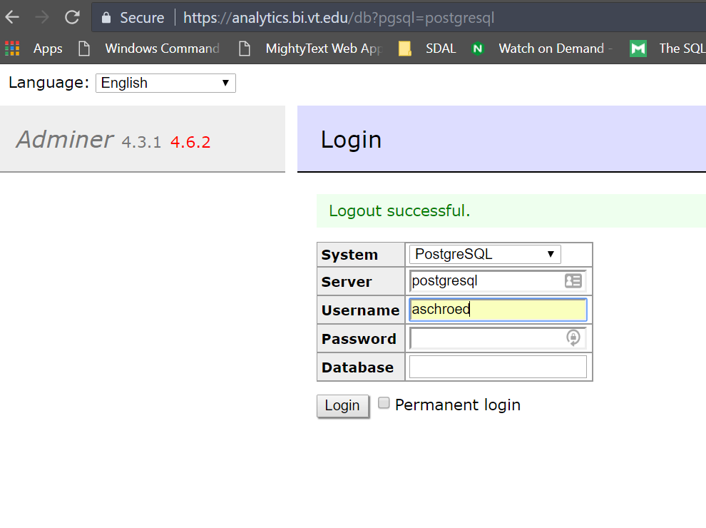
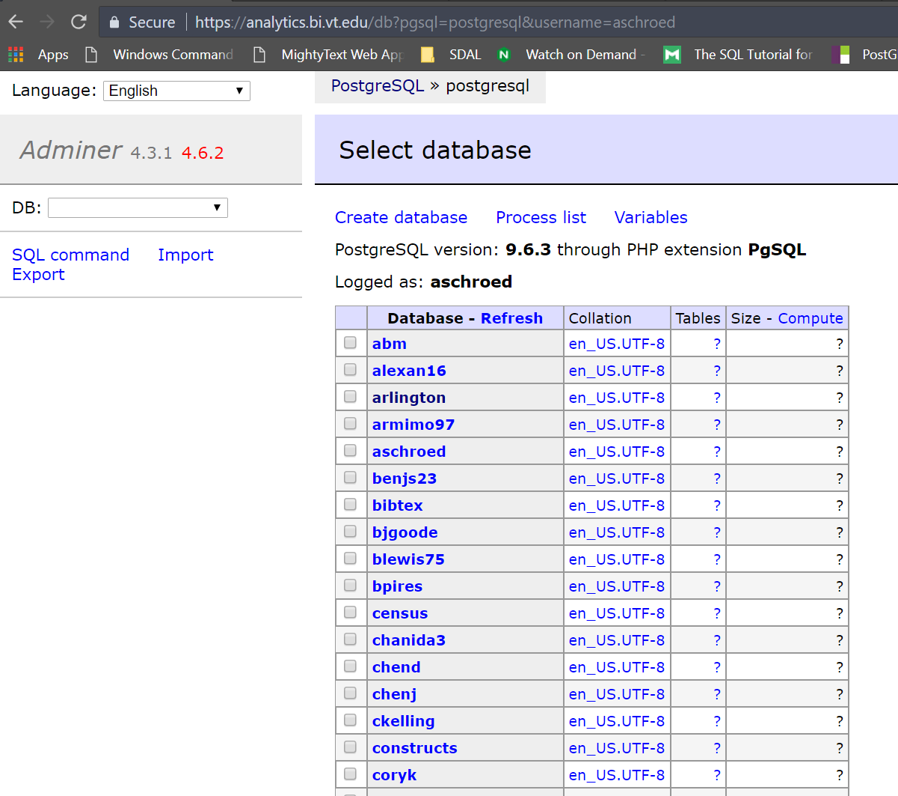
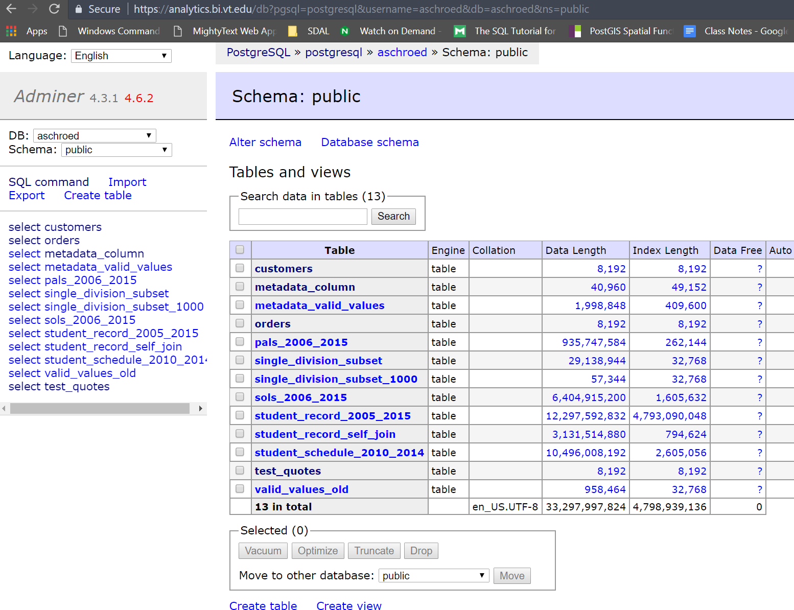
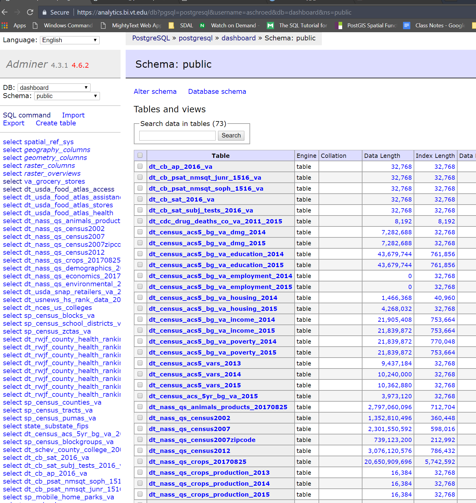
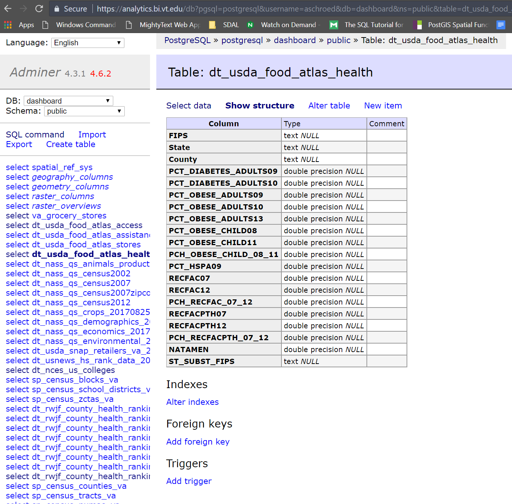
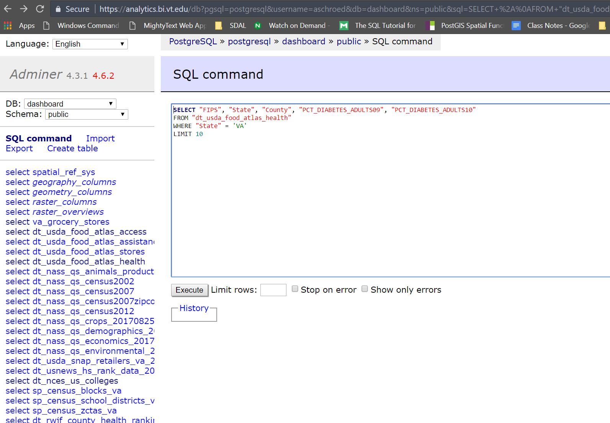
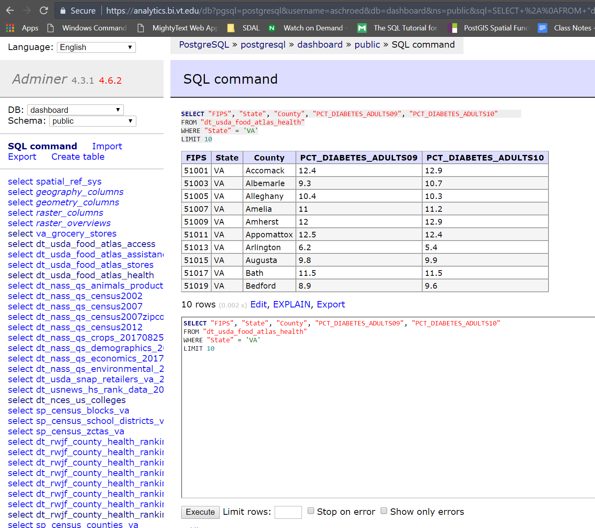
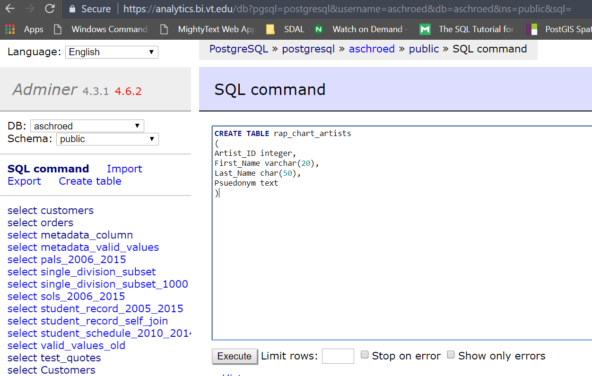
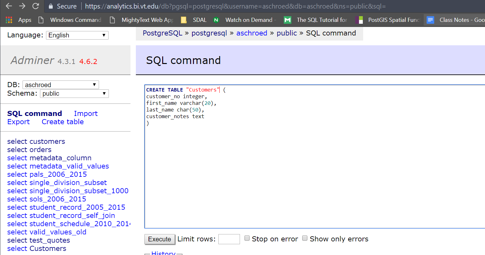

## Adminer Database Login, Database and Table Selection

```{r echo=FALSE, fig.cap="Adminer Login", out.width = '90%'}

```
<hr />
```{r echo=FALSE, fig.cap="Adminer Database Selection", out.width = '90%'}

```
<hr />
```{r echo=FALSE, fig.cap="Adminer Personal Database", out.width = '90%'}

```
<hr />
```{r echo=FALSE, fig.cap="Adminer Dashboard Database", out.width = '90%'}

```
```{r echo=FALSE, fig.cap="Adminer Dashboard Database Food Atlas Table Structure", out.width = '90%'}

```
<hr />
```{r echo=FALSE, fig.cap="Adminer Dashboard Database Food Atlas Table Data Query", out.width = '90%'}

```
<hr />
```{r echo=FALSE, fig.cap="Adminer Dashboard Database Food Atlas Table Data Query Result", out.width = '90%'}

```
<hr />
```{r echo=FALSE, fig.cap="Adminer Dashboard Personal Database", out.width = '90%'}

```
<hr />
```{r echo=FALSE, fig.cap="Adminer Dashboard Personal Database Create Table", out.width = '90%'}

```
<!-- <hr /> -->
<!-- ```{r echo=FALSE, fig.cap="Adminer Dashboard Personal Database Create Table Upper Case", out.width = '90%'} -->
<!--  -->
<!-- ``` -->
<hr />

## CREATE TABLE
<pre><code>
CREATE TABLE rap_chart_artists
(
Artist_ID integer,
First_Name varchar(20),
Last_Name char(50),
Psuedonym text
)

Look at table structure, what happened?
Difference in Data Types
Fix
</pre></code>

## INSERT
<pre><code>
INSERT INTO rap_chart_artists ("Artist_ID", "First_Name", "Last_Name", "Psuedonym") VALUES (1, 'James', 'Smith', 'LL Cool J')

additional data
2	Stanley	Burrell	M.C. Hammer
3	Marvin	Young	Young M.C.
4	O'Shea	Jackson	Ice Cube

</pre></code>

## SELECT WHERE
<pre><code>
SELECT * 
FROM rap_chart_artists 

SELECT "Last_Name", "Psuedonym"
FROM rap_chart_artists 

SELECT "Last_Name", "Psuedonym"
FROM rap_chart_artists 
WHERE Psuedonym = 'LL Cool J'

What happens? Quotes!

</pre></code>


## SELECT WHERE LIKE, COUNT, GROUP
<pre><code>

LIKE fuzzy search '%LL%' '%M.C.%'


COUNT, GROUP Aggregate Functions

</pre></code>

## CREATE ANOTHER TABLE
<pre><code>
CREATE TABLE rap_chart_singles
(
Artist_ID integer,
"Year" varchar(20),
"Single" char(50),
"Top_US_Rap_Chart" text,
"Album" text
)


insert data
1	1991	"Mama Said Knock You Out"	1	Mama Said Knock You Out
2	1990	"U Can't Touch This"	2	Please Hammer, Don't Hurt 'Em
3	1989	"Bust a Move"	2	Stone Cold Rhymin'

</pre></code>


## SELECT DISTINCT
<pre></code>
distinct function
SELECT DISTINCT "Top_US_Rap_Chart" FROM rap_chart_singles

</pre></code>


## JOINING
<pre></code>
# join (inner join)

SELECT *
FROM rap_chart_artists
JOIN rap_chart_singles ON rap_chart_artists."Artist_ID" = rap_chart_singles ."Artist_ID"

SELECT *
FROM rap_chart_artists a
JOIN rap_chart_singles s ON a."Artist_ID" = s."Artist_ID"

join (left join)
SELECT *
FROM rap_chart_artists a
LEFT JOIN rap_chart_singles s ON a."Artist_ID" = s."Artist_ID"

# concatenation

SELECT "First_Name" || "Last_Name" AS name, "Single"
FROM rap_chart_artists a
LEFT JOIN rap_chart_singles s ON a."Artist_ID" = s."Artist_ID"

</pre></code>


## DROP
<pre></code>
Let's create a larger relational database
DROP table rap_chart_artists 

cp /home/sdal/projects/sdal/db/Rap_Charts.xlsx ~/
</pre></code>

